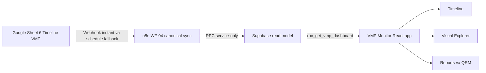

# VMP Monitor

VMP Monitor la dashboard theo doi Ke hoach Tham dinh Goc cua CPC1 HN. Ung dung
doc du lieu tu Supabase read model, hien thi tien do, canh bao, workload, QRM va
bao cao theo cac moc De cuong - Tham dinh thuc te - Bao cao - VMP.


## Trang thai nhanh

| Hang muc | Trang thai |
| --- | --- |
| Frontend | React 18 + Vite |
| Du lieu runtime | Supabase RPC `rpc_get_vmp_dashboard` |
| Dong bo upstream | Google Sheet canonical qua n8n WF-04 |
| Che do browser | Read-only voi du lieu nghiep vu |
| Kiem thu local | `npm run build` |

## Luong du lieu



## Man hinh chinh

- **Tong quan**: KPI, ti le hoan thanh va cac chi bao theo trang thai.
- **Timeline VMP**: ban do moc theo thang, quy, nam va bang quan sat 3 moc.
- **Danh muc doi tuong**: doi tuong thiet bi, quy trinh, kho, he thong phu tro,
  van chuyen.
- **Canh bao**: hang muc toi han, qua han va lech pha ho so.
- **QRM va workload**: phan tich rui ro chat luong va tai cong viec theo nguoi,
  phong ban, thang.
- **Bao cao va AI**: tong hop theo ky, xuat bao cao va goi y nhan xet.

## Kien truc GitHub-ready

Repo nay duoc nang cap theo huong de doc va demo tren GitHub:

- README co so do Mermaid render truc tiep tren GitHub.
- `docs/architecture-2026-07.md` mo ta nguon du lieu va hang rao an toan.
- `docs/github-upgrade-plan.md` ghi ro ke hoach nang cap theo phase.
- `docs/data-contract.md` dinh nghia contract cho timeline, diagram va dashboard.
- `docs/improvement-history.md` ghi lich su tung buoc cai tien.

## Cai dat local

```bash
npm install
cp .env.example .env
npm run dev
```

Can cau hinh toi thieu trong `.env`:

```bash
VITE_SUPABASE_URL=https://<project-ref>.supabase.co
VITE_SUPABASE_ANON=<anon-key-jwt>
```

Luu y: `VITE_SUPABASE_ANON` la anon key danh cho client, khong phai service role.
Khong commit `.env` hoac bat ky secret nao.

## Kiem tra build

```bash
npm run build
```

## Chinh sach an toan

- Browser khong duoc ghi truc tiep du lieu nghiep vu VMP.
- Supabase trong frontend chi dung anon key va RPC/doc bang duoc RLS bao ve.
- Cac hanh dong ghi schema/du lieu Supabase, sua/publish workflow n8n, `git push`
  va tao PR can duoc xac nhan rieng.
- Google Sheet van la nguon nghiep vu canonical neu quy trinh WF-04 dang hoat
  dong. Supabase la read model phuc vu dashboard.

## Tai lieu tham khao ky thuat

Cac lua chon giao dien va diagram tham khao tu nhom open-source pho bien:

- [Mermaid](https://github.com/mermaid-js/mermaid) cho diagram trong Markdown.
- [React Flow / xyflow](https://github.com/xyflow/xyflow) cho node graph tuong tac.
- [vis-timeline](https://github.com/visjs/vis-timeline) cho timeline day va co zoom.
- [react-chrono](https://github.com/prabhuignoto/react-chrono) cho milestone narrative.
- [react-grid-layout](https://github.com/react-grid-layout/react-grid-layout) cho dashboard widget layout.
- [TanStack Table](https://github.com/tanstack/table) cho data grid co filter/sort.
